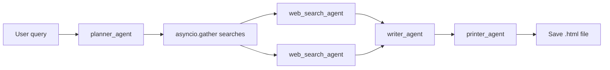
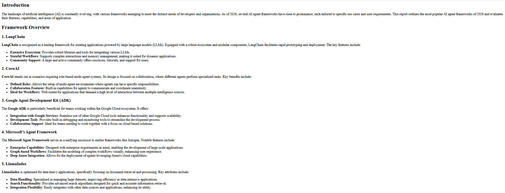

# Research Agents

A multi-agent research pipeline with the [OpenAI Agents SDK](https://openai.github.io/openai-agents-python/). Python code orchestrates each step: plan searches → search the web in parallel → write a report → save HTML.

| Agent | Role |
|-------|------|
| **planner_agent** | Turns a query into 2 web search terms (`WebSearchPlan`) |
| **web_search_agent** | Searches via LangSearch (`web_search` tool) and summarizes |
| **writer_agent** | Writes a markdown research report (`ReportData`) |
| **printer_agent** | Converts the report to HTML and saves a `.html` file |



**Pattern:** orchestration by code — your Python (`plan` → `write` → `print_report`) controls the flow with `Runner.run` and `asyncio.gather`.

```bash
python research.py
```

---



---

## Prerequisites

- **Python 3.12+**
- **OpenAI API key** — [platform.openai.com/api-keys](https://platform.openai.com/api-keys)
- **LangSearch API key** — for web search

## Setup

```bash
cd research-agents

python -m venv .venv

# Windows
.venv\Scripts\activate

# macOS / Linux
source .venv/bin/activate

pip install -r requirements.txt

# Create .env and add keys (see below)
```

## Corporate proxy (optional)

If API calls fail with SSL/certificate errors behind a corporate proxy, [`proxy_patch.py`](proxy_patch.py) disables SSL verification for `httpx` and `requests`. It is imported at the top of `research.py`:

```python
import proxy_patch
```

- **Behind a corporate proxy:** keep this import.
- **Not behind a proxy:** remove or comment out `import proxy_patch`.

## Environment variables

| Variable | Required | Description |
|----------|----------|-------------|
| `OPENAI_API_KEY` | Yes | OpenAI API key for the agents |
| `OPENAI_MODEL` | No | Model name (default: `gpt-4o-mini`) |
| `LANGRAPH_SEARCH_API_KEY` | Yes | LangSearch API key for web search |
| `LANGRAPH_WEB_SEARCH_URL` | No | Override LangSearch endpoint |

## Project layout

```
research-agents/
├── research.py        # Full research pipeline
├── proxy_patch.py     # Optional: SSL workaround for corporate proxies
├── requirements.txt
├── .env
└── README.md
```

## Traces

Runs use `with trace("Research Agent")` so they appear on the [OpenAI Traces dashboard](https://platform.openai.com/traces).

## License

Use and modify as you like for learning and personal projects.
